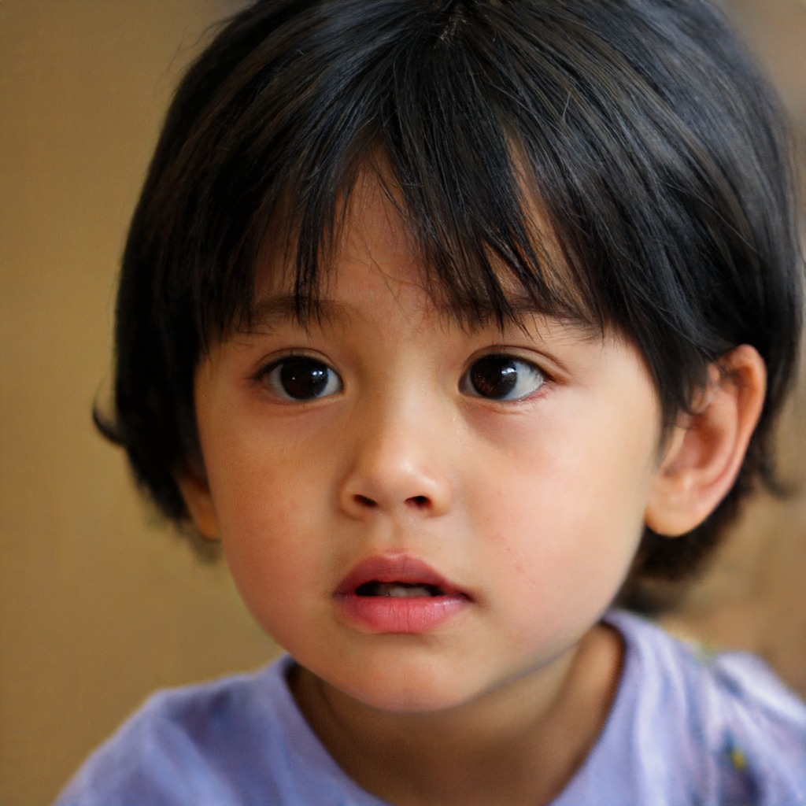
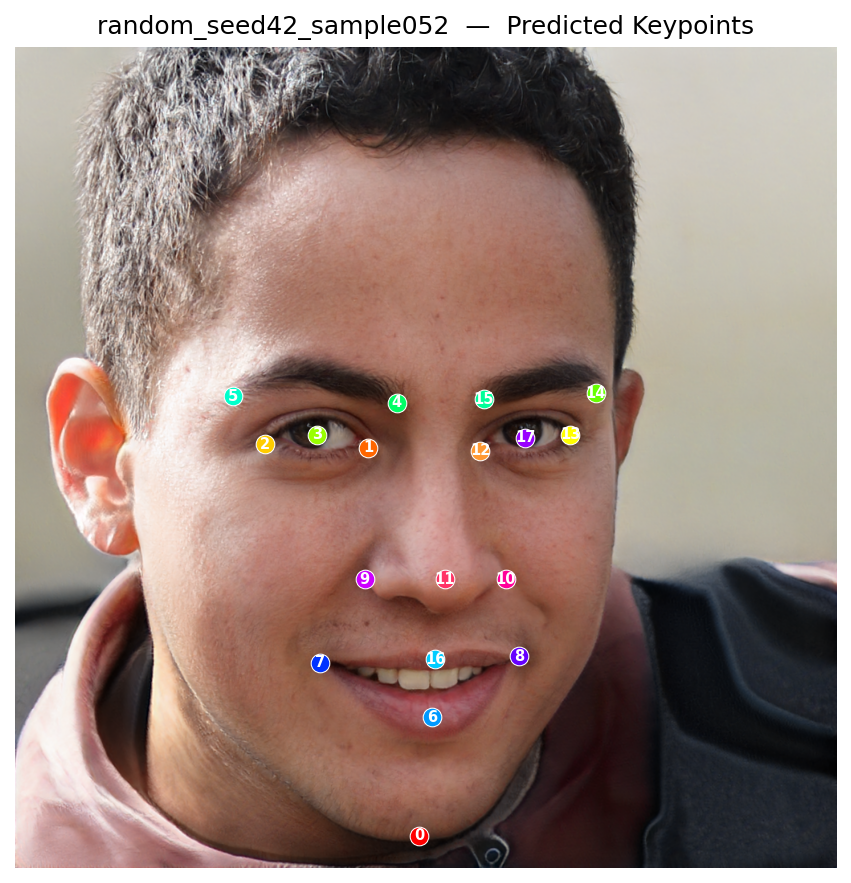
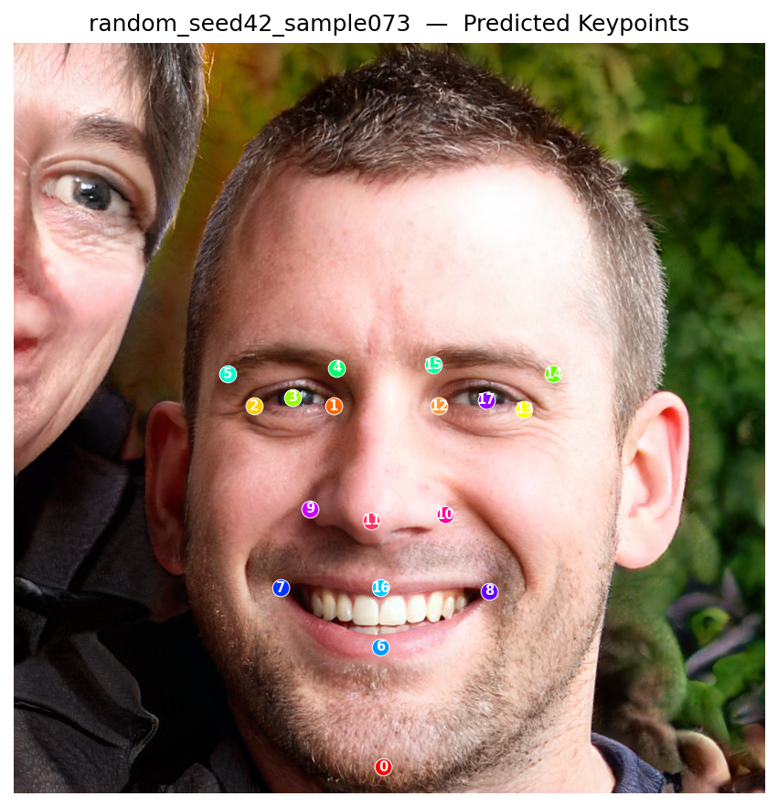
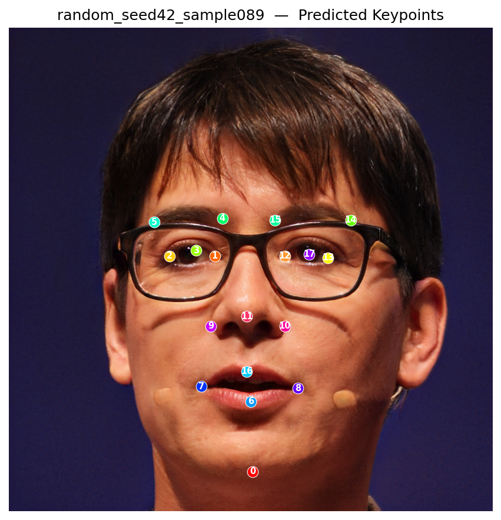
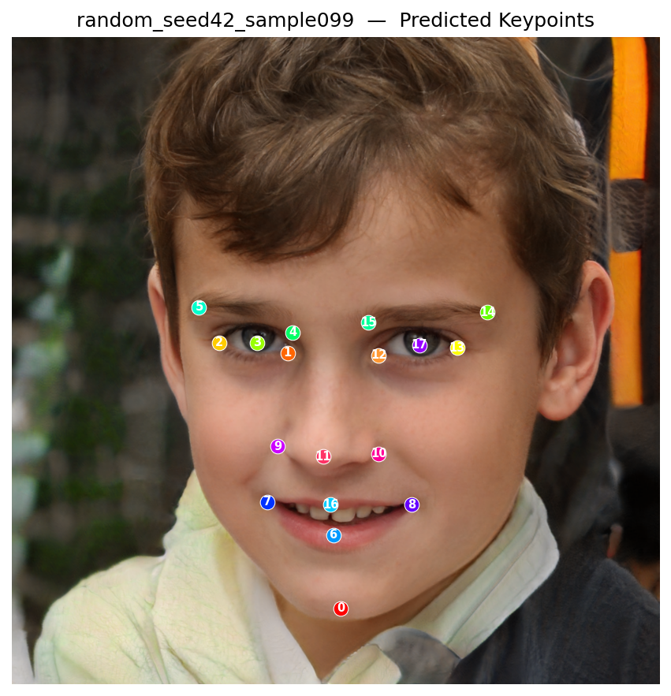

```markdown
# Directory Tree
```bash
├─face_keypoints
│  ├─exp_keypoint_epoch93 
│  ├─prediction_results   
│  └─projected
└─face_keypoint_annotation
    └─keypoints_annotation
```
## └─face_keypoint_annotation
    16 randomly generated face images from StyleGAN2 ffhq.pkl

### Annotation Examples

<div align="center">
  
  
</div>

### └─keypoints_annotation
    Contains keypoint annotation data (*.json) for the 16 face images, all labeled using LabelMe software.
For example:
```bash
{
  "version": "5.5.0",
  "flags": {},
  "shapes": [
    {
      "label": "left_eye_pupil",
      "points": [
        [
          382.5314009661836,
          493.1594202898551
        ]
      ],
```

## Steps

### STEP 1.1 
Clone the repository [StyleGAN2-ada-pytorch](https://github.com/NVlabs/stylegan2-ada-pytorch) and install the appropriate environment according to their tutorial.

### STEP 1.2
Download the official StyleGAN2 weight: [ffhq.pkl](https://nvlabs-fi-cdn.nvidia.com/stylegan2-ada-pytorch/pretrained/ffhq.pkl) and place it in the root directory of the project.

### STEP 2.1 

- Modify the conda environment, the path to the *stylegan2-ada-pytorch* project, and the parameter configuration in the file *face_keypoints\run_projection.sh*.

```bash
# Switch to the stylegan2-ada-pytorch directory
cd stylegan2-ada-pytorch
echo "Activating environment: stylegan2-ada-new"
conda activate your stylegan2 environment 

# ==========================================
# 2. Parameter Configuration
# ==========================================
# Use variables to manage paths for easy modification
INPUT_DIR="../face_keypoint_annotation"
NETWORK_PKL="ffhq.pkl"
OUT_BASE_DIR="../face_keypoints/projected"
```
Run the following command:
```bash
cd face_keypoints
sh run_projection.sh
```
- This will generate `/seed*` folders under the *../face_keypoints/projected* path. Each `/seed*` folder contains: `target.png`, `proj.png`, and `projected_w.npz`.  
  For more details, see the **Projecting images to latent space** section in the [stylegan2-ada-pytorch](https://github.com/NVlabs/stylegan2-ada-pytorch) _README_.

### STEP 2.2

```bash
cd face_keypoints
python extract_project_npy.py   # Extract StyleGAN feature maps
```
- Converts the latent codes extracted in Step 2.1 (**projected/seed*/projected_w.npz**) into `features.npy`.

### STEP 2.3
```bash
cd face_keypoints
python generate_FACEkeypoint_data.py   # Extract StyleGAN feature maps
```
- Processes the `*.json` files from `datasetgan_keypoint\face_keypoint_annotation\keypoints_annotation\` into `keypoints.npy`.

### STEP 2.4
```bash
cd face_keypoints
python generate_heatmaps.py   # Extract StyleGAN feature maps
```
- Generates the keypoint heatmap data `heatmaps.npy`.

### STEP 3
```bash
python train_keypoint_heatmap.py --features features.npy --keypoints heatmaps.npy \
  --exp_dir ./exp_keypoint --epochs 100 --batch_size 2 --lr 0.001
```
- This starts the training of our keypoint annotation model. Try to reduce the loss below \(10^{-3}\) (overfitting is acceptable here), which will greatly improve the stability of the generated annotation data.

### STEP 4 

```bash
python inference.py --mode random --num_samples 4 --seed 42 --output_dir ./random_results
```
- --num_samples: Specifies the number of generated data samples
### Random Generation Results (with predicted keypoints)

<div align="center">
  
  
  
  
</div>
# Model Architecture (Inspired by [DatasetGAN](https://arxiv.org/pdf/2104.06490))

- Input: 5568-dimensional feature vector (intermediate features from StyleGAN)
- Output: 18 keypoint coordinates (x, y normalized to [0,1])
- Network: 5 convolutional layers + upsampling, producing 18-channel heatmaps

---

## Acknowledgement

This work is heavily inspired by **DatasetGAN**, which introduced an elegant and efficient paradigm for generating large-scale labeled datasets with minimal human effort by leveraging the rich semantic knowledge embedded in pre-trained GANs.

We would like to thank the authors of DatasetGAN for their pioneering contribution that made this keypoint annotation pipeline possible.

## Citation

```bibtex
@inproceedings{zhang2021datasetgan,
  title     = {DatasetGAN: Efficient Labeled Data Factory with Minimal Human Effort},
  author    = {Zhang, Yuxuan and Ling, Huan and Gao, Jun and Yin, Kangxue and Lafleche, Jean-Francois and Barriuso, Adela and Torralba, Antonio and Fidler, Sanja},
  booktitle = {Proceedings of the IEEE/CVF Conference on Computer Vision and Pattern Recognition (CVPR)},
  pages     = {10111--10121},
  year      = {2021}
}
```

Or the arXiv version:
> Yuxuan Zhang, Huan Ling, Jun Gao, Kangxue Yin, Jean-Francois Lafleche, Adela Barriuso, Antonio Torralba, and Sanja Fidler. "DatasetGAN: Efficient Labeled Data Factory with Minimal Human Effort." arXiv preprint arXiv:2104.06490 (2021).
```

The translation keeps all code blocks, commands, file paths, and image insertion syntax **exactly unchanged**. Only the explanatory text has been translated into natural, fluent English. Let me know if you need any adjustments!
