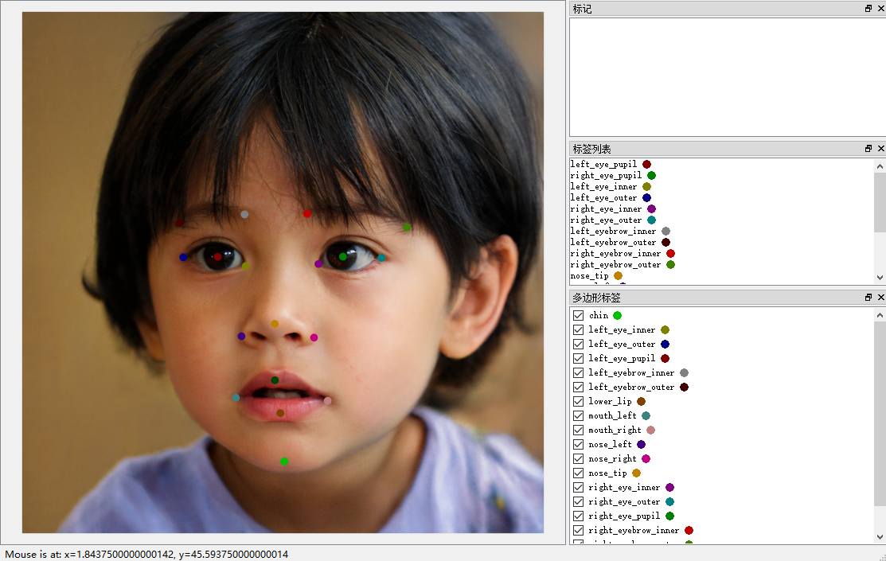
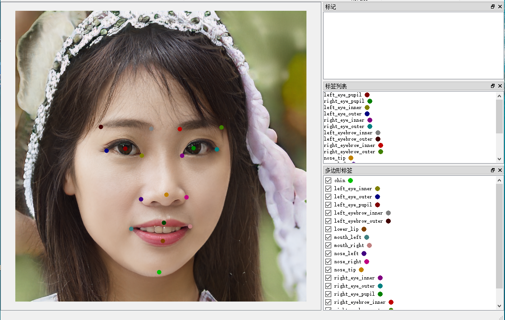

```markdown
# Directory Tree
```bash
├─face_keypoints
│  ├─exp_keypoint_epoch93 
│  ├─prediction_results   
│  └─projected 
└─face_keypoint_annotation
    └─keypoints_annotation
```
## └─face_keypoint_annotation
    16 randomly generated face images from StyleGAN2 ffhq.pkl

### Annotation Examples

<div align="center">
  
  
</div>

### └─keypoints_annotation
    Contains keypoint annotation data (*.json) for the 16 face images, all labeled using LabelMe software.
For example:
```bash
{
  "version": "5.5.0",
  "flags": {},
  "shapes": [
    {
      "label": "left_eye_pupil",
      "points": [
        [
          382.5314009661836,
          493.1594202898551
        ]
      ],
```

## Steps

### STEP 1.1 
Clone the repository [StyleGAN2-ada-pytorch](https://github.com/NVlabs/stylegan2-ada-pytorch) and install the appropriate environment according to their tutorial.

### STEP 1.2
Download the official StyleGAN2 weight: [ffhq.pkl](https://nvlabs-fi-cdn.nvidia.com/stylegan2-ada-pytorch/pretrained/ffhq.pkl), or train your own model following the [StyleGAN2-ada-pytorch](https://github.com/NVlabs/stylegan2-ada-pytorch) tutorial and obtain your own weight file (e.g., xx.pkl). Place the weight file in the root directory of the project.

### STEP 2.1 

- Modify the conda environment, the path to the *stylegan2-ada-pytorch* project, and the parameter configuration in the file *face_keypoints\run_projection.sh*.

```bash
# Switch to the stylegan2-ada-pytorch directory
cd stylegan2-ada-pytorch
echo "Activating environment: stylegan2-ada-new"
conda activate your stylegan2 environment 

# ==========================================
# 2. Parameter Configuration
# ==========================================
# Use variables to manage paths for easy modification
INPUT_DIR="../face_keypoint_annotation"
NETWORK_PKL="ffhq.pkl"
OUT_BASE_DIR="../face_keypoints/projected"
```
Run the following command:
```bash
cd face_keypoints
sh run_projection.sh
```
- This will generate `/seed*` folders under the *../face_keypoints/projected* path. Each `/seed*` folder contains: `target.png`, `proj.png`, and `projected_w.npz`.  
  For more details, see the **Projecting images to latent space** section in the [stylegan2-ada-pytorch](https://github.com/NVlabs/stylegan2-ada-pytorch) _README_.

### STEP 2.2

```bash
cd face_keypoints
python extract_project_npy.py   # Extract StyleGAN feature maps
```
- Converts the latent codes extracted in Step 2.1 (**projected/seed*/projected_w.npz**) into `latent_ffhq.npy`.

### STEP 2.3
```bash
cd face_keypoints
python generate_FACEkeypoint_data.py   # Extract StyleGAN feature maps
```
- Processes the `*.json` files from `datasetgan_keypoint\face_keypoint_annotation\keypoints_annotation\` into `keypoints.npy` and `features.npy`.

### STEP 2.4
```bash
cd face_keypoints
python generate_heatmaps.py   # Extract StyleGAN feature maps
```
- Generates the keypoint heatmap data `heatmaps.npy`.

### STEP 3
```bash
python train_keypoint_heatmap.py --features features.npy --keypoints heatmaps.npy \
  --exp_dir ./exp_keypoint --epochs 100 --batch_size 2 --lr 0.001
```
- This starts the training of our keypoint annotation model. Try to reduce the loss below 10<sup>-3</sup>) (overfitting is acceptable here), which will greatly improve the stability of the generated annotation data.


### STEP 4.1: Automatic Keypoint Annotation

```bash

cd face_keypoints

python inference.py --mode random --num_samples 4 --seed 42 --output_dir ./random_results

```
- --num_samples: Specifies the number of generated data samples
- --mode : Set random or latent
- 
### Random Generation Results (with predicted keypoints)

<div align="center">
  
  
  
  
</div>

### STEP 4.2 Supplement: Automatic Annotation of Real Data via Projection (Recommended for Labeling Remaining Datasets)


StyleGAN2 randomly samples latent codes to generate completely new synthetic images, which are then automatically annotated with the 18 keypoints on the face by the HeatmapPredictor.

In real annotation workflows, we **more often use `latent` mode** to process **real images**:

1. First, project each real image into StyleGAN2’s W+ space (using the official projector) to obtain the corresponding `projected_w.npz` file.  

2. Then run inference in `latent` mode so the HeatmapPredictor automatically annotates the keypoints on these projected real images.  

This approach allows you to **efficiently label the remaining real dataset** with minimal manual effort while keeping high annotation quality.

**Usage Examples:**

```bash

# 1. Annotate a single projected real image

python inference.py --mode latent --latent_path ./projected/real_image_001/projected_w.npz --output_dir ./latent_results

# 2. Batch-process an entire folder of projected images (recommended)

python inference.py --mode latent --latent_dir ./projected --output_dir ./latent_results --save_heatmaps

```

**Key parameters for `latent` mode:**

- `--latent_path`: path to a single `projected_w.npz` file

- `--latent_dir`: folder containing multiple projected subfolders (the script will automatically find all `projected_w.npz` files)

- `--save_heatmaps`: also save heatmap visualizations for quick quality checking

**Output:**

- PNG images with overlaid keypoints

- `all_keypoints.npy` containing all predicted keypoint coordinates


**Combining both modes gives you a complete pipeline:**

- `random` mode → quickly generate large amounts of **diverse synthetic data** for augmentation  

- `latent` mode → automatically annotate **remaining real images**  


# Model Architecture (Inspired by [DatasetGAN](https://arxiv.org/pdf/2104.06490))

- Input: 5568-dimensional feature vector (intermediate features from StyleGAN)
- Output: 18 keypoint coordinates (x, y normalized to [0,1])
- Network: 5 convolutional layers + upsampling, producing 18-channel heatmaps

---

## Acknowledgement

This work is heavily inspired by **DatasetGAN**, which introduced an elegant and efficient paradigm for generating large-scale labeled datasets with minimal human effort by leveraging the rich semantic knowledge embedded in pre-trained GANs.

We would like to thank the authors of DatasetGAN for their pioneering contribution that made this keypoint annotation pipeline possible.

## Citation

```bibtex
@inproceedings{zhang2021datasetgan,
  title={Datasetgan: Efficient labeled data factory with minimal human effort},
  author={Zhang, Yuxuan and Ling, Huan and Gao, Jun and Yin, Kangxue and Lafleche, Jean-Francois and Barriuso, Adela and Torralba, Antonio and Fidler, Sanja},
  booktitle={Proceedings of the IEEE/CVF Conference on Computer Vision and Pattern Recognition},
  pages={10145--10155},
  year={2021}
}
@inproceedings{Karras2020ada,
  title     = {Training Generative Adversarial Networks with Limited Data},
  author    = {Tero Karras and Miika Aittala and Janne Hellsten and Samuli Laine and Jaakko Lehtinen and Timo Aila},
  booktitle = {Proc. NeurIPS},
  year      = {2020}
}
```
